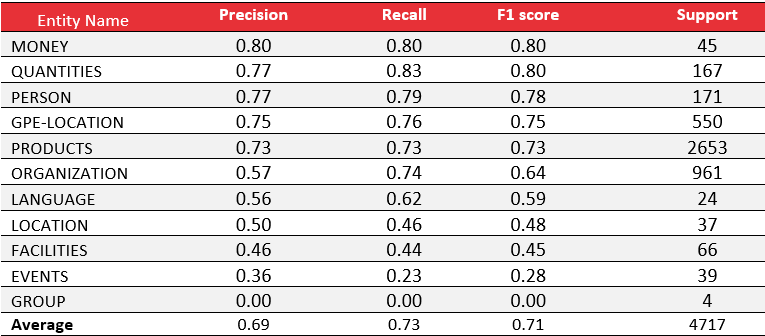
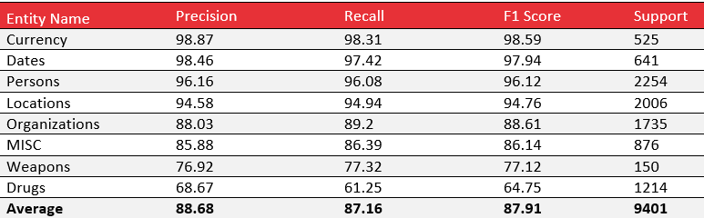

# NamedEntityRecognition

Named Entity Recognition for Spanish and English using Transformers

For **English**, the following classes are supported:

- Drug name
- Weapon name
- Person
- Date
- Money
- Location
- Language
- MISC

For **Spanish**, the following classes are supported:

- PRODUCTS
- ORGANIZATION
- GPE-LOCATION
- QUANTITIES
- PERSON
- FACILITIES
- EVENTS
- MONEY
- LOCATION
- LANGUAGE
- GROUP

## Training

### English dataset

For English, I used dataset of 32,702 unique sentences distributed as 80/20 for training and testing.
That range of sentence length is between 3 and 200 words, with an average size of 8 words per sentence.
The dataset was collected from websites of the TOR network and labeled manually.

As a base BERT model, I used "bert-base-multilingual-cased"

### Spanish dataset

For Spanish, I used a dataset of 35,639 sentences split as 80/20 into train and test. As a base BERT model, I used "
bert-base-multilingual-cased"

Unfortunately, we cannot share the dataset as it was developed for private business purposes._

## Performance

#### Spanish model:



#### English model:



## Try the model!

1- After you clone the repo, create a conda env with python 3.8:

```commandline
conda create -n ner python=3.8 
conda activate ner
```

2- install the requirements:

```commandline
pip install -r requirements.txt
```

3- Run the RestAPI interface (from python)

```commandline
python app.py
```

## Input/output example

As an input, the model needs text, language and text encoding. Then, for the output, the model returns the detected
entities with their index and confidence.

#### Input:

```json
{
  "text": "Eduardo is the best Cocaine and marijuana seller in France, Spain, and Northern Europe. He can sell 50 grams. By the way, bring your M16 gun with you, to protect yourself ;). Tell him Fran bought hashish from there :)",
  "encoding": "UTF-8",
  "lang": "en"
}
```

```json
{
  "response": {
    "CUR": [],
    "DAT": [],
    "DRG": [
      "Cocaine",
      "marijuana",
      "hashish"
    ],
    "LOC": [
      "France",
      "Spain",
      "Northern Europe"
    ],
    "MISC": [],
    "ORG": [],
    "PER": [
      "Eduardo",
      "Fran"
    ],
    "WEP": [
      "M16 gun"
    ]
  },
  "result_collapsed": [
    [
      "Eduardo",
      "PER",
      0,
      1,
      0.97
    ],
    [
      "Cocaine",
      "DRG",
      4,
      5,
      0.99
    ],
    [
      "marijuana",
      "DRG",
      6,
      7,
      0.99
    ],
    [
      "France",
      "LOC",
      9,
      10,
      1.0
    ],
    [
      "Spain",
      "LOC",
      11,
      12,
      1.0
    ],
    [
      "Northern Europe",
      "LOC",
      14,
      16,
      0.9299999999999999
    ],
    [
      "M16 gun",
      "WEP",
      29,
      31,
      0.935
    ],
    [
      "Fran",
      "PER",
      42,
      43,
      0.99
    ],
    [
      "hashish",
      "DRG",
      44,
      45,
      0.78
    ]
  ],
  "spent_time": 0.45090556144714355
}
```